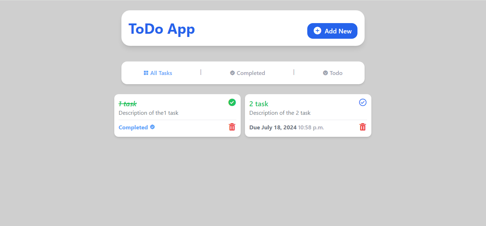
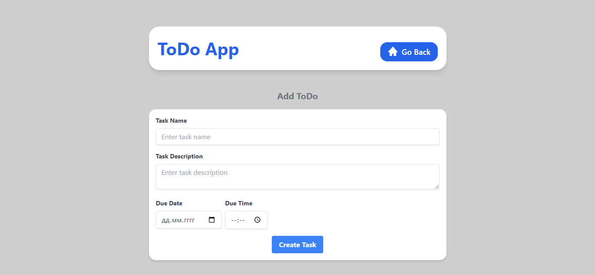

# ToDo App

This is a minimalist and adaptive ToDo application built with Django. The application allows users to add tasks, sort them as completed or not completed, and manage their tasks efficiently. The design is created using Tailwind CSS.

**Home Page**

**Add Task Page**

## Features

- **Add New Tasks**: Users can add new tasks with a description.
- **Sort Tasks**: Users can sort tasks as completed or not completed.
- **Task Management**: Easily manage and delete tasks.
- **Minimalist Design**: Clean and simple user interface.
- **Responsive Design**: Adaptive layout for different screen sizes.

## Installation

1. **Clone the repository:**
   ```bash
   git clone https://github.com/shevchenkkko/ToDoApp.git
    ```
2. **Create and activate a virtual environment:**

    ```bash
    python3 -m venv venv  # On Windows, use `python -m venv venv`
    source venv/bin/activate  # On Windows, use `venv\Scripts\activate`
    ```
3. **Install the dependencies:**
   ```bash
   pip install -r requirements.txt
    ```
4. **Run database migrations:**
   ```bash 
   python manage.py makemigrations
   python manage.py migrate
   ```
5. **Create superuser:**
    ```bash
    python manage.py createsuperuser
    ```
6. **Start the development server:**
   ```bash
   python manage.py runserver
    ```

## Usage 
1. Open your web browser and navigate to http://127.0.0.1:8000/.
2. Use the Add New button to add tasks.
3. Sort tasks using the All Tasks, Completed, and Todo filters.
4. Mark tasks as completed by clicking the check mark button.
5. Delete tasks using the trash can icon.

## License
This project is licensed under the MIT License.

## Contact 
For more projects, visit my [GitHub](https://github.com/shevchenkkko/).